<div align="center">


### Dots &amp; Boxes, played inside a Reddit post

<br />



<br />
<br />


**Make your move. Walk away. Get a DM when it's your turn.**

</div>

<br />

Draw lines on a grid of dots. Complete the fourth side of a box and you claim it — and you go again. Own the most boxes when the board fills up and you win. Play runs over a **24-hour turn window**, so a match breathes across a day the way Reddit already does. 2–4 players per board, or drop in a bot if nobody's around. Win streaks, a subreddit-wide leaderboard, ELO flair on your username, and a daily challenge keep people coming back.

> One Reddit post = one game.

<br />

<details open>
<summary><b>&nbsp;🎮&nbsp; How to play</b></summary>

<br />

1. **Open a squeezeblocks post** and tap **Play**.
2. **Drag between two neighboring dots** to draw a line.
3. **Close a box** to capture it — that earns you **another turn**.
4. Make your move and leave. Reddit **DMs you** when it's your turn again.
5. Most boxes when the grid is full **wins**. Climb the leaderboard, keep the streak alive.

</details>

<details>
<summary><b>&nbsp;🧱&nbsp; Built with</b></summary>

<br />

| Layer | Tech |
|-------|------|
| **Platform** | Reddit Devvit Web — one post per game |
| **Client** | React 19 · Vite · Tailwind v4 · Phaser 4 (board canvas) |
| **Server** | Hono on Devvit's serverless Node runtime — plain JSON routes |
| **State** | Redis (one key per post) |
| **Realtime** | Devvit Realtime channel per post, polling fallback |
| **Turns** | Devvit Scheduler (30s sweep + daily post) |
| **API** | Reddit API — DMs, user flair, post create/sticky/remove |
| **Language** | TypeScript, end to end |

</details>

<details>
<summary><b>&nbsp;📂&nbsp; Layout</b></summary>

<br />

```
src/
  shared/engine.ts    Pure Dots-and-Boxes rules. No I/O.
  shared/online.ts    Lobby / seats / phase envelope + message types.
  server/core/        Redis load-save, join/move/skip, bot, stats, notify.
  server/routes/      Hono HTTP + Devvit /internal hooks (menu, triggers, scheduler).
  client/             OnlineGame.tsx (app), board.tsx (Phaser), splash.* (feed view).
```

The rules engine is **pure** and knows nothing about Reddit — the server layers the async deadline and turn DMs on top.

</details>

<details>
<summary><b>&nbsp;⚙️&nbsp; Run it locally</b></summary>

<br />

```bash
npm install
npm run dev          # devvit playtest — live on the dev subreddit
npm test             # engine / notify / daily / elo flow tests
npm run type-check   # tsc --build
npm run deploy       # type-check + lint + devvit upload
```

> Regenerate the animation above: `node tools/gen-anim.mjs` → `public/assets/demo-v3.svg`

</details>

<br />

<div align="center">

_Dots and Boxes is a game my mother taught me. squeezeblocks is made in her memory._

**For my mother.**

</div>
